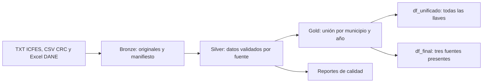

# Proyecto ETL Medallón: trabajo realizado, resultados, ejecución y GitHub

Fecha de esta entrega: 22 de septiembre de 2026. Versión del proyecto: **1.1.0**.

## 1. Qué construimos

Construimos un proyecto en Python para integrar resultados de Saber 11, accesos
residenciales a Internet fijo y proyecciones de hogares. El resultado permite
estudiar estas variables por **municipio del colegio y año**.

El proyecto contiene código comentado en español, configuración, controles de
calidad, ocho pruebas automáticas, documentación, un cuaderno Jupyter y un ZIP
con código y resultados. Los documentos y scripts anteriores se usaron como
referencia; las cifras se reconstruyeron desde las fuentes originales disponibles.

La carpeta principal en el equipo de Oscar es:

```text
/Users/oscar/Documents/ChatGPT/ETL
```

## 2. Fuentes encontradas

Las fuentes están en:

```text
/Users/oscar/Desktop/ETL/Trabajo Final/Archivos-Datos
```

| Fuente | Archivos | Uso |
| --- | --- | --- |
| ICFES | Siete TXT: 20221, 20222, 20231, 20232, 20241, 20242, 20251 | Puntaje global por municipio del colegio |
| CRC | `ACCESOS_INTERNET_FIJO_2_8.csv` | Accesos residenciales por municipio y trimestre |
| DANE | `anexo-proyecciones-hogares-dptal-mpal-2018-2042.xlsx` | Total de hogares por municipio y año |

El `df_final.csv` anterior se utilizó para comparar resultados, no como entrada
para construir el nuevo panel. **No se encontró el TXT ICFES 20252**.

## 3. Cómo aplicamos Medallón



### Bronze: conservar el origen

Copiamos los archivos sin cambiar su contenido. Calculamos una huella SHA-256
para identificar cada versión y verificar la copia. Los archivos idénticos se
reutilizan en nuevas ejecuciones. El manifiesto registra origen, copia, tamaño
y huella. Bronze ocupa aproximadamente 1,8 GB.

El DataFrame `df_bronze_catalogo` contiene el inventario de archivos. Los registros
originales siguen en sus archivos: no se concatenan estudiantes, conexiones y
hogares como si fueran la misma clase de observación.

### Silver: validar y preparar

- **ICFES:** reunimos los TXT por municipio-periodo, conservando suma de puntajes
  y número de registros válidos. Validamos código, puntaje, periodo e identificador.
- **CRC:** seleccionamos años solicitados y segmentos residenciales; sumamos
  accesos por municipio-año-trimestre.
- **DANE:** leemos la hoja municipal, conservamos el área `Total` y transformamos
  las columnas de años en filas. Así evitamos sumar Total, Cabecera y Rural dos veces.
- Normalizamos DIVIPOLA a texto de cinco dígitos: `5001` pasa a `05001`.
- Registramos rechazos y detenemos el proceso ante fallos estructurales o
  duplicados de llaves que harían ambiguo el resultado.

Los archivos grandes se leen por bloques. El control de identificadores ICFES
mantiene en memoria los identificadores de cada periodo para detectar duplicados.

### Gold: unificar y calcular

Llevamos las fuentes a la misma unidad: **código de municipio + año**.

```text
puntaje_global = suma de puntajes / cantidad de registros válidos

accesos_residenciales = promedio de los totales trimestrales disponibles

accesos_por_100_hogares = accesos_residenciales / hogares × 100
```

Ejemplo del promedio ponderado: un periodo con un estudiante de 100 puntos y
otro con dos estudiantes de 300 produce `(100 + 600) / 3 = 233,33`, no 200.

`df_unificado` conserva todas las llaves presentes en alguna fuente y deja
nulos donde falta información. `df_final` selecciona solamente las llaves con
las tres fuentes. Los nombres de municipios proceden del DANE; no son la llave.

## 4. Resultados obtenidos

| Capa | DataFrame | Filas | Columnas |
| --- | --- | ---: | ---: |
| Bronze | `df_bronze_catalogo` | 9 | 5 |
| Silver | `df_icfes` | 3.982 | 6 |
| Silver | `df_crc` | 17.276 | 4 |
| Silver | `df_dane` | 4.486 | 6 |
| Gold | `df_unificado` | 4.492 | 17 |
| Gold | `df_final` | 3.427 | 13 |
| Gold | `df_resumen_anual` | 4 | 5 |
| Calidad | `df_cobertura` | 4.492 | 6 |
| Calidad | `df_balance` | 9 | 4 |

El panel final contiene **1.102 municipios distintos**. Una misma localidad
puede aparecer en varios años, por eso tiene 3.427 filas.

| Año | Municipios integrados | Puntaje medio municipal | Accesos por 100 hogares: media municipal |
| --- | ---: | ---: | ---: |
| 2022 | 1.087 | 238,33 | 15,98 |
| 2023 | 1.090 | 241,11 | 16,59 |
| 2024 | 1.093 | 242,93 | 17,29 |
| 2025 | 157 | 240,89 | 43,41 |

Estas medias dan el mismo peso a cada municipio. No son promedios nacionales
ponderados por estudiantes u hogares.

### Calidad y limitaciones

- Se rechazaron **357.770 registros ICFES** por código municipal inválido o vacío.
- Se rechazaron **seis registros DANE municipio-año** por hogares inválidos.
- CRC no tuvo rechazos de las validaciones implementadas. **2.184.153 registros
  válidos** quedaron fuera de los años o segmento solicitados.
- **1.065 llaves municipio-año** no reunieron las tres fuentes.
- Se conservaron **seis tasas superiores a 100**: son accesos por cien hogares,
  no porcentaje de hogares conectados.
- **2.950 filas** no reúnen dos periodos ICFES y cuatro trimestres CRC. Esta señal
  es conservadora: un municipio puede tener un solo periodo por su calendario
  escolar. No demuestra por sí sola que falten datos que deberían existir.

**2025 es parcial:** solo contamos con ICFES 20251. Sus 157 municipios no son una
muestra comparable automáticamente con los más de mil de otros años. No debe
interpretarse el salto de conectividad como crecimiento anual demostrado.

En 2022–2024, puntajes, accesos y hogares coinciden con la base anterior dentro
de una tolerancia de `1e-9`. Para 2025, la base anterior tenía 1.091 municipios;
con los archivos actuales no podemos reconstruir ni verificar su puntaje anual.

Esta integración permite análisis municipal; no demuestra causalidad entre
Internet y resultados individuales de estudiantes. CRC asume filas aditivas y
no valida duplicados de negocio en todas las dimensiones del archivo original.

## 5. Qué verificamos

Se ejecutó el ETL completo con las fuentes reales. La primera versión reprodujo
las tablas Silver y Gold en una segunda ejecución. Después añadimos la API de
DataFrames, la unión externa y el cuaderno, y volvimos a ejecutar el proyecto.

Las **ocho pruebas automáticas** pasaron: códigos DIVIPOLA, medias ponderadas,
trimestres, cruces sin coincidencia, nulos, tasas, denominadores, duplicados,
cuarentena y lectura por bloques. También comprobamos que el ZIP se descomprime
y permite cargar los nueve DataFrames desde otra carpeta.

Las celdas Python del cuaderno se verificaron en orden mediante ejecución de
su código; no se validó una sesión interactiva de Jupyter en este entorno.
Se utilizó el Python disponible en el entorno de trabajo con pandas 2.2.3 y
openpyxl 3.1.5. Tu entorno `.venv` se prepara con los pasos siguientes.

## 6. Organización del proyecto

```text
ETL/
├── GUIA_COMPLETA_PROYECTO.md
├── README.md
├── requirements.txt
├── ejecutar_proyecto.py
├── proyecto_medallon.ipynb
├── config/
│   ├── ejemplo.json
│   └── local.json                    # Solo en tu equipo
├── etl_medallon/
│   ├── __init__.py                    # API y versión
│   ├── __main__.py                    # Coordinación del proceso
│   ├── bronze.py                      # Copias y manifiesto
│   ├── silver.py                      # Validación por fuente
│   ├── gold.py                        # Integración e indicadores
│   ├── dataframes.py                  # Carga y ejecución desde Python
│   └── common.py                      # Utilidades compartidas
├── tests/test_pipeline.py
├── docs/                             # Guías y diccionario
├── data/                             # Datos locales, excluidos de Git
│   ├── bronze/
│   ├── latest.json
│   └── runs/<ejecucion>/
│       ├── silver/
│       ├── gold/
│       ├── quality/
│       ├── manifest.json
│       ├── report.json
│       └── pipeline.log
└── entrega/Proyecto_ETL_Medallon.zip
```

Cada ejecución crea una carpeta nueva. `data/latest.json` apunta a la última
terminada correctamente. Un fallo no reemplaza ese puntero.

## 7. Cómo ejecutarlo en tu Mac

### Paso 1. Abrir la carpeta y crear el entorno

Se requiere Python 3.10 o posterior. Ejecuta estos comandos en Terminal:

```bash
cd /Users/oscar/Documents/ChatGPT/ETL
python3 --version
python3 -m venv .venv
source .venv/bin/activate
python -m pip install -r requirements.txt
```

En sesiones futuras basta con entrar en la carpeta y activar `.venv`.

### Paso 2. Revisar la configuración

En tu equipo ya existe `config/local.json`. **No lo sobrescribas si conserva
la ruta correcta.** En un equipo nuevo, créalo copiando el ejemplo:

```bash
cp config/ejemplo.json config/local.json
```

Abre el archivo y adapta `source_dir`:

```json
{
  "source_dir": "/Users/oscar/Desktop/ETL/Trabajo Final/Archivos-Datos",
  "output_dir": "data",
  "years": [2022, 2023, 2024, 2025],
  "chunksize": 50000
}
```

Los originales deben estar descargados localmente. `output_dir` se interpreta
desde la carpeta de ejecución del comando; usa la raíz del proyecto.

### Paso 3. Inventario y pruebas

```bash
python -m etl_medallon --config config/local.json --inventory
python -m unittest discover -s tests -v
```

### Paso 4. Ejecutar todas las capas

```bash
python ejecutar_proyecto.py
```

La consola muestra el avance y el tamaño de los DataFrames. Como alternativa,
puedes ejecutar el coordinador directamente:

```bash
python -m etl_medallon --config config/local.json
```

Ambos reconstruyen el ETL; no necesitas ejecutar los dos. Reutilizan las copias
Bronze idénticas y recalculan Silver/Gold. No es una carga incremental por registro.

### Paso 5. Consultar resultados existentes

```bash
python ejecutar_proyecto.py --solo-cargar
```

Ese comando usa `data/latest.json` del proyecto local. Para la entrega ZIP, usa
la carga explícita de `resultados/` explicada en la sección 10.

## 8. Cómo trabajar con los DataFrames

Ejecuta el siguiente código dentro de Python, un archivo `.py` o el cuaderno,
desde la carpeta del proyecto:

```python
from etl_medallon import cargar_dataframes

datos = cargar_dataframes()
df_icfes = datos["df_icfes"]
df_crc = datos["df_crc"]
df_dane = datos["df_dane"]
df_unificado = datos["df_unificado"]
df_final = datos["df_final"]

print(df_final.head())
print(df_final.groupby("anio").size())

# Revisar las llaves con alguna fuente ausente.
sin_coincidencia = df_unificado.loc[~df_unificado["integrado"]]
print(sin_coincidencia.head())
```

Para reconstruir y obtener las tablas en una sola llamada:

```python
from etl_medallon import ejecutar_etl

datos = ejecutar_etl()
df_final = datos["df_final"]
```

No rellenes automáticamente los nulos con cero: la ausencia de una fuente no
equivale a cero estudiantes o cero conexiones. El cargador mantiene DIVIPOLA
como texto y los conteos como enteros que admiten nulos.

## 9. Cómo abrir el cuaderno Jupyter

Con el entorno virtual activo:

```bash
python -m pip install jupyterlab
python -m jupyterlab proyecto_medallon.ipynb
```

Ejecuta las celdas de arriba hacia abajo. El cuaderno usa `resultados/` si existe
esa carpeta de entrega; en caso contrario carga la última ejecución local.
La instalación de Jupyter es opcional: el ETL por consola no la necesita.

## 10. Cómo compartir los resultados sin enviar los originales

El archivo `entrega/Proyecto_ETL_Medallon.zip` contiene código, documentación,
cuaderno y la carpeta `resultados/` con las tablas y reportes. No incluye las
copias Bronze de 1,8 GB ni tu configuración `local.json`.

Tu amigo puede descomprimirlo, abrir una terminal dentro de `Proyecto_ETL_Medallon`
y ejecutar:

```bash
python3 -m venv .venv
source .venv/bin/activate
python -m pip install -r requirements.txt
```

Luego, desde Python:

```python
from etl_medallon import cargar_dataframes

datos = cargar_dataframes(run_dir="resultados")
df_unificado = datos["df_unificado"]
df_final = datos["df_final"]
print(df_final.head())
```

En Windows puede crear el entorno con `py -m venv .venv` y activarlo desde
CMD con `.venv\Scripts\activate.bat`. Las rutas JSON de Windows pueden escribirse
con barras `/`, por ejemplo `C:/Datos/Archivos-Datos`.

Los manifiestos y reportes conservan rutas locales como trazabilidad histórica;
no se necesita que esas rutas existan para cargar los resultados. Para reconstruir
desde cero sí hacen falta los originales y una configuración propia.

## 11. Cómo subir el código a GitHub

Al preparar esta guía, la carpeta ya tenía Git inicializado, pero **no tenía
commits ni remoto configurado**. No se ha publicado en GitHub.

### 11.1 Crear un repositorio vacío

En GitHub, crea un repositorio llamado, por ejemplo, `etl-medallon-saber11`.
Elige público o privado. No lo inicialices con README, licencia ni `.gitignore`,
pues ya tienes archivos locales. Este procedimiento sigue la
[guía oficial para subir un proyecto existente](https://docs.github.com/en/migrations/importing-source-code/using-the-command-line-to-import-source-code/adding-locally-hosted-code-to-github).

### 11.2 Preparar el primer commit

Reemplaza los valores de ejemplo por los tuyos:

```bash
cd /Users/oscar/Documents/ChatGPT/ETL
git config user.name "TU NOMBRE"
git config user.email "TU CORREO DE GITHUB"
git status
git add .gitignore README.md GUIA_COMPLETA_PROYECTO.md requirements.txt ejecutar_proyecto.py proyecto_medallon.ipynb config/ejemplo.json etl_medallon docs tests
git diff --cached --stat
git commit -m "Proyecto ETL Medallon con ICFES, CRC y DANE"
```

La selección explícita incluye el código y las guías. `.gitignore` excluye
`data/`, `entrega/`, `.venv/`, cachés y `config/local.json`. No uses `git add -f`
para incorporar los originales. El cuaderno contiene salidas agregadas ya guardadas.

### 11.3 Conectar y subir

```bash
git remote add origin https://github.com/TU_USUARIO/etl-medallon-saber11.git
git remote -v
git push -u origin main
```

`TU_USUARIO` es un marcador: debes sustituirlo. La rama local observada es `main`.
Si `origin` ya existe, revisa `git remote -v` antes de cambiarlo.

GitHub requiere autenticación. Puedes usar GitHub CLI, si ya lo tienes instalado,
con `gh auth login` y `gh auth setup-git`, o configurar un gestor de credenciales.
Para HTTPS, la contraseña normal de la cuenta no sustituye un token de acceso
cuando Git solicita credenciales. Consulta las
[opciones oficiales de autenticación](https://docs.github.com/en/authentication/keeping-your-account-and-data-secure/about-authentication-to-github).

### 11.4 Subir cambios posteriores

Después de modificar y probar el código:

```bash
git status
git add etl_medallon docs tests README.md GUIA_COMPLETA_PROYECTO.md
git diff --cached --stat
git commit -m "Actualiza transformaciones y documentacion"
git push
```

Añade expresamente otros archivos si también los modificaste. `git diff --cached`
muestra lo que quedará en el commit; `git push` publica los commits.

## 12. Cómo compartirlo con amigos desde GitHub

### Compartir el código

Envía la dirección de tu repositorio:

```text
https://github.com/TU_USUARIO/etl-medallon-saber11
```

Un repositorio público permite consultar el contenido. Para dar acceso a uno
privado o permitir colaboración, entra en **Settings → Collaborators → Add people**,
busca a tu amigo y envía la invitación. Debe aceptarla. La invitación a colaborar
otorga capacidad de contribuir, no solamente recibir un archivo. Consulta la
[guía oficial de colaboradores](https://docs.github.com/en/repositories/managing-your-repositorys-settings-and-features/repository-access-and-collaboration/inviting-collaborators-to-a-personal-repository).

### Compartir una entrega con resultados

Después de subir el código, entra en **Releases → Draft a new release**. Crea
la etiqueta `v1.1.0`, escribe un título, adjunta manualmente
`entrega/Proyecto_ETL_Medallon.zip` y publica la entrega. Envía a tus amigos el
enlace de esa release. GitHub permite adjuntar archivos al publicar una versión;
consulta [cómo gestionar releases](https://docs.github.com/en/repositories/releasing-projects-on-github/managing-releases-in-a-repository).

**Importante:** el ZIP automático de código que genera GitHub no contiene tus
datos excluidos de Git. Tus amigos deben descargar el adjunto
`Proyecto_ETL_Medallon.zip` para obtener `resultados/` sin reconstruir el ETL.

### Colaborar en cambios

Para trabajar sobre el código, tu amigo puede clonar el repositorio y crear una
rama propia. Sustituye `TU_USUARIO`:

```bash
git clone https://github.com/TU_USUARIO/etl-medallon-saber11.git
cd etl-medallon-saber11
git switch -c mejora-documentacion
```

Después de editar, probar y guardar sus cambios:

```bash
git add docs
git commit -m "Mejora la documentacion"
git push -u origin mejora-documentacion
```

Con permisos de escritura podrá subir esa rama y proponer un Pull Request desde
GitHub. Si solamente quiere estudiar resultados, basta con descargar la entrega.
Un clon del código, por sí solo, no incluye fuentes ni `data/latest.json`.

## 13. Qué hacer cuando llegue el periodo 20252

1. Colocar el TXT original en `Archivos-Datos/Datos ICFES/`.
2. Confirmar el nombre `Examen_Saber_11_20252.txt` y revisar su cabecera.
3. Ejecutar `python ejecutar_proyecto.py`.
4. Revisar `report.json`, los rechazos y la cobertura de la nueva ejecución.
5. Actualizar las cifras de la documentación y preparar una nueva entrega.

El ZIP entregado es una fotografía de los resultados actuales: no se actualiza
automáticamente al ejecutar el ETL. Tampoco este documento cambia sus cifras
automáticamente. Los reportes de cada nueva ejecución son la evidencia vigente.

## 14. Solución de problemas frecuentes

| Problema | Acción |
| --- | --- |
| `No module named pandas` | Activa `.venv` e instala `requirements.txt` |
| No aparece `local.json` | Copia `config/ejemplo.json` y configura tus rutas |
| No encuentra los originales | Revisa `source_dir` y descarga los archivos de iCloud |
| No existe `data/latest.json` | Ejecuta el ETL o carga la entrega con `run_dir="resultados"` |
| `df_unificado.csv` no existe en una ejecución antigua | Ejecuta la versión actualizada del proyecto |
| `remote origin already exists` | Revisa `git remote -v`; no repitas la creación del remoto |
| Error de autenticación en GitHub | Revisa credenciales y acceso al repositorio |
| Git rechaza el push por cambios remotos | Revisa e integra el historial remoto; no fuerces el push |
| Tu amigo no recibe los resultados al clonar | Descarga el ZIP adjunto a la release |
| 2025 tiene menos municipios | Falta el archivo 20252; no inventes filas para completar el año |

## 15. Documentación complementaria

- [README e instrucciones breves](README.md).
- [Explicación de cada transformación](docs/01_paso_a_paso.md).
- [Diccionario y reglas de negocio](docs/02_diccionario_y_reglas.md).
- [Resultados de las fuentes originales](docs/03_resultados_verificados.md).
- [Cuaderno del proyecto](proyecto_medallon.ipynb).

La parte técnica queda implementada y verificada con los archivos disponibles.
La publicación en GitHub y las invitaciones descritas aquí son pasos que todavía
debes realizar; esta guía no significa que ya se hayan publicado o enviado.
