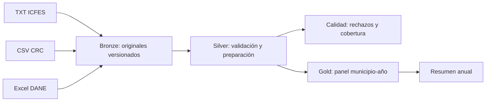

# ETL en Python con arquitectura Medallón

Proyecto educativo y ejecutable para integrar **Saber 11 (ICFES), accesos
residenciales a Internet fijo (CRC) y proyecciones de hogares (DANE)**.
La unidad final de análisis es **municipio del colegio y año**.

## Entrega completa: DataFrames listos

Abre `proyecto_medallon.ipynb` para recorrer el proyecto por celdas, o ejecuta:

```bash
python ejecutar_proyecto.py
```

Para cargar los resultados ya generados sin volver a procesar los originales:

```python
from etl_medallon import cargar_dataframes

datos = cargar_dataframes()
df_icfes = datos["df_icfes"]
df_crc = datos["df_crc"]
df_dane = datos["df_dane"]
df_unificado = datos["df_unificado"]  # Unión externa; conserva ausencias.
df_final = datos["df_final"]          # Coincidencias de las tres fuentes.
```

Para reconstruir todo desde Python: `from etl_medallon import ejecutar_etl`,
seguido de `datos = ejecutar_etl()`. Los códigos se cargan como texto, los
conteos como enteros que admiten nulos y las señales como booleanos.

| Capa | DataFrame | Unidad de cada fila |
| --- | --- | --- |
| Bronze | `df_bronze_catalogo` | Archivo original y su copia verificada |
| Silver | `df_icfes` | Municipio-periodo, todos los TXT seleccionados reunidos |
| Silver | `df_crc` | Municipio-año-trimestre, accesos residenciales sumados |
| Silver | `df_dane` | Municipio-año, proyección de hogares |
| Gold | `df_unificado` | Municipio-año presente en al menos una fuente |
| Gold | `df_final` | Municipio-año con las tres fuentes |
| Gold | `df_resumen_anual` | Año, medias municipales y cobertura |
| Calidad | `df_cobertura`, `df_balance` | Cobertura del cruce y balance por archivo |

Bronze conserva los datos originales como archivos. El catálogo es su DataFrame
de trazabilidad; no mezcla en una misma tabla registros de estudiantes y conexiones.

La entrega ZIP incluye código, guía, cuaderno y resultados en `resultados/`.
Después de descomprimirla puedes usar `cargar_dataframes(run_dir="resultados")`.
Los originales Bronze (aproximadamente 1,8 GB) permanecen en la carpeta local
`data/bronze`; no se duplican dentro del ZIP. Para reconstruir desde otro equipo,
necesitas los originales y ajustar `config/local.json` a partir del ejemplo.

Empieza por [la guía paso a paso](docs/01_paso_a_paso.md). Las reglas y campos
están en [el diccionario](docs/02_diccionario_y_reglas.md).
Consulta también [los resultados verificados con tus fuentes](docs/03_resultados_verificados.md).

## 1. Qué significa Medallón

| Capa | Qué hacemos | Producto |
| --- | --- | --- |
| Bronze | Conservar copias exactas y registrar su procedencia | TXT, CSV y XLSX originales con huellas SHA-256 |
| Silver | Validar, normalizar y preparar cada fuente | ICFES municipio-periodo, CRC municipio-trimestre, DANE municipio-año |
| Gold | Integrar fuentes y calcular indicadores | Panel municipio-año y resumen anual |



Es una implementación local por lotes, con pandas y archivos CSV; no requiere
Spark ni servicios en la nube. Medallón organiza responsabilidades y niveles
de calidad. No exige una herramienta particular.

## 2. Instalar

Requiere Python 3.10 o posterior. Abre una terminal en la carpeta del proyecto:

```bash
cd /Users/oscar/Documents/ChatGPT/ETL
python3 -m venv .venv
source .venv/bin/activate
python -m pip install -r requirements.txt
```

Las versiones de las dos dependencias están fijadas a las usadas para verificar
este proyecto. En Windows, activa el entorno con `.venv\Scripts\activate`.

## 3. Configurar las fuentes

En este equipo ya está preparado `config/local.json`, que apunta a
`/Users/oscar/Desktop/ETL/Trabajo Final/Archivos-Datos`.
Para otro equipo, copia `config/ejemplo.json` a `config/local.json` y cambia
`source_dir`. `output_dir` es relativo a la carpeta desde la que ejecutas Python.

```text
Archivos-Datos/
  Datos ICFES/
    Examen_Saber_11_20221.txt
    ...
  ACCESOS_INTERNET_FIJO_2_8.csv
  anexo-proyecciones-hogares-dptal-mpal-2018-2042.xlsx
```

`years` selecciona años; `chunksize` controla filas leídas por bloque. Las
columnas y la estructura del Excel se validan según los archivos entregados.

## 4. Revisar y ejecutar

```bash
python -m etl_medallon --config config/local.json --inventory
python -m unittest discover -s tests -v
python -m etl_medallon --config config/local.json
```

La primera ejecución copia aproximadamente 1,8 GB a Bronze. Las siguientes
reutilizan las copias de contenido idéntico y recalculan Silver/Gold. El diseño
es de reconstrucción completa, no de actualización incremental de registros.

## 5. Encontrar los resultados

`data/latest.json` indica la última ejecución terminada correctamente.

```text
data/
  bronze/<fuente>/<sha256>/<archivo_original>
  latest.json
  runs/<ejecucion>/
    manifest.json
    report.json
    pipeline.log
    silver/
      icfes_municipio_periodo.csv
      crc_municipio_trimestre.csv
      dane_municipio_anio.csv
    gold/
      df_unificado.csv
      panel_municipio_anio.csv
      resumen_anual.csv
    quality/
      balance_fuentes.csv
      cobertura_cruces.csv
      rechazos.csv  (solo si hay rechazos)
```

Cada ejecución tiene una carpeta nueva. Una ejecución fallida queda registrada
y no reemplaza el puntero a la última ejecución correcta. Las salidas parciales
de una ejecución fallida no deben usarse para análisis.

## 6. Decisiones que debes conocer

- Se encontraron siete TXT ICFES: 20221, 20222, 20231, 20232, 20241, 20242 y 20251.
  Falta 20252. Su ausencia se registra, sin inventar ni sustituir observaciones.
- El archivo `df_final.csv` existente es un resultado anterior. No se usa como
  fuente del nuevo panel ni se exige reproducir sus 4.361 filas.
- El puntaje anual pondera por registros válidos de los periodos disponibles.
- Los accesos anuales promedian los totales trimestrales disponibles. Un trimestre
  ausente no se considera cero. La cobertura se muestra en cada fila.
- `accesos_por_100_hogares` cuenta accesos por cada cien hogares; no equivale al
  porcentaje de hogares conectados. Puede superar 100 y se conserva con una señal.
- La cobertura temporal completa significa dos periodos ICFES y cuatro trimestres
  CRC observados en ese municipio-año. No certifica la exhaustividad de cada fuente.
- Un año parcial, especialmente 2025, puede representar una población diferente.
  No debe interpretarse automáticamente como una tendencia anual comparable.

## 7. Archivos para aprender el código

1. `etl_medallon/__main__.py`: configuración y orden de ejecución.
2. `etl_medallon/bronze.py`: descubrimiento, copia y huellas de integridad.
3. `etl_medallon/silver.py`: lectura por bloques y reglas por fuente.
4. `etl_medallon/gold.py`: promedios, cruces e indicadores.
5. `etl_medallon/common.py`: utilidades compartidas.
6. `tests/test_pipeline.py`: ejemplos pequeños con resultados calculables a mano.

Los comentarios y docstrings están en español. Los originales y resultados de
datos están excluidos de Git. Las copias Bronze contienen todos los campos de
origen; para compartir el proyecto basta con el código y la documentación.
